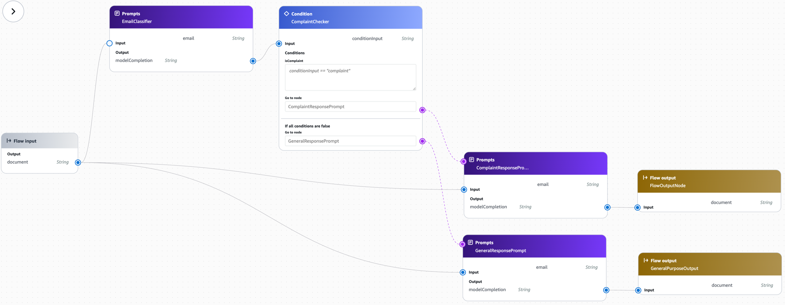
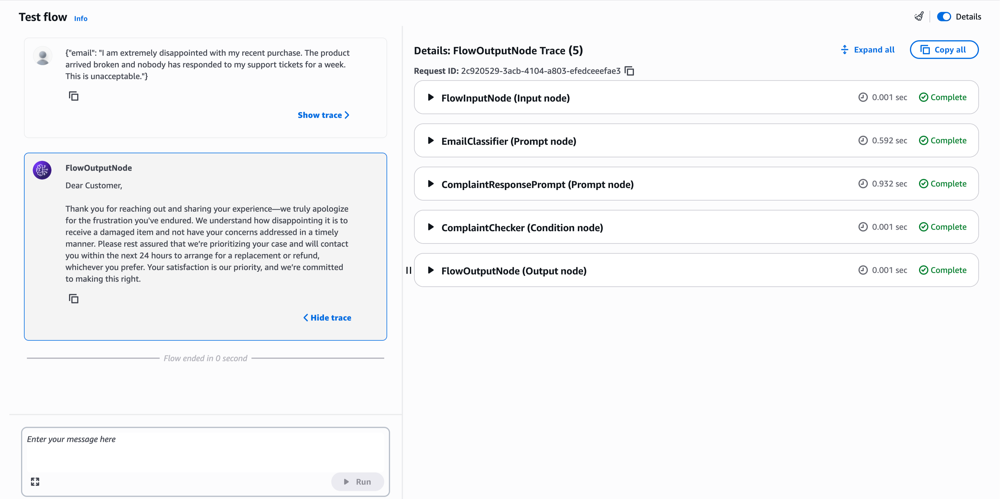
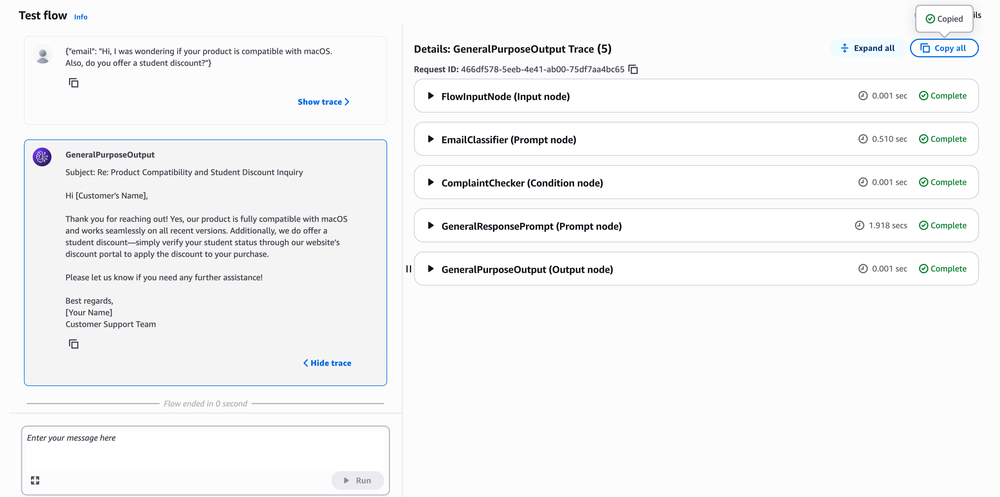

# Email Router — Amazon Bedrock Flows

A customer support email routing pipeline built using Amazon Bedrock Flows and Prompt Management. The flow classifies an incoming email by intent and routes it to a tailored response-generation prompt, producing a context-appropriate reply without any custom backend code.



## Objective

Customer support inboxes receive a mix of complaints, questions, and refund requests, each warranting a different tone and handling. This project uses native Bedrock components — prompt nodes and a condition node — to classify and respond to emails automatically, with each step implemented as an independent, testable node rather than a single monolithic prompt.

## How It Works

1. An email is submitted to the flow as a JSON payload.
2. A classifier prompt labels the email as `complaint` or `question`.
3. A condition node evaluates the classification:
   - If `complaint`, the flow routes to a prompt that generates an empathetic, resolution-focused response.
   - Otherwise, the flow routes to a prompt that generates a general professional response.
4. The generated reply is returned as the flow output.

## Design Rationale

Each step in the pipeline is isolated into its own node: classification, routing, and response generation are handled independently. This keeps each prompt narrowly scoped and allows response wording to be revised without modifying the classification logic, simplifying iteration and testing.

## Prompts

Three prompt templates were created in Bedrock Prompt Management and connected to the flow as prompt nodes.

### EmailClassifier

Classifies the email intent. Output is constrained to a single lowercase label to serve as a direct input to the condition node.

```
You are an email classifier. Read the following customer email and classify it
as exactly one of: complaint, question, or refund. Respond with only the
classification label in lowercase, nothing else.

Customer email: {{email}}
```

### ComplaintResponsePrompt

Triggered when the classification is `complaint`. Generates a response that acknowledges the issue before offering a resolution.

```
You are a customer service agent. Read the following customer complaint and
write a brief, empathetic response (3-4 sentences) that acknowledges the issue
and offers a resolution.

Customer email: {{email}}
```

### GeneralResponsePrompt

Handles all non-complaint emails (questions and refund requests). Produces a neutral, professional response.

```
You are a helpful customer service agent. Read the following customer email
and write a brief, professional response (3-4 sentences).

Customer email: {{email}}
```

## Flow Structure

As shown in the flow builder screenshot above, the pipeline consists of the following nodes:

| Node | Type | Function |
|---|---|---|
| Flow input | Input | Accepts a JSON payload of the form `{ "email": "..." }` |
| EmailClassifier | Prompt | Classifies the email, outputs `modelCompletion` |
| ComplaintChecker | Condition | Evaluates `conditionInput == "complaint"`; routes accordingly |
| ComplaintResponsePrompt | Prompt | Generates the empathetic response |
| GeneralResponsePrompt | Prompt | Generates the general response |
| Flow output (×2) | Output | Returns the generated reply from the active branch |

## Validation

The flow was tested with two representative inputs.



A complaint regarding a damaged product and an unanswered support ticket was correctly classified as `complaint` and routed to the empathetic response prompt. The generated reply acknowledged the issue and committed to a resolution within twenty-four hours.



A question regarding macOS compatibility and student discount availability was classified as `question`, fell through to the default branch, and produced a concise professional response addressing both points.

Both test cases confirmed correct branching behavior and prompt-specific tone adherence.

## Notes

This project was built and tested in the `us-east-1` region. Prompt and flow ARNs visible in the screenshot are specific to the originating AWS account and will not resolve elsewhere; the prompt templates above are sufficient to reproduce the setup independently.