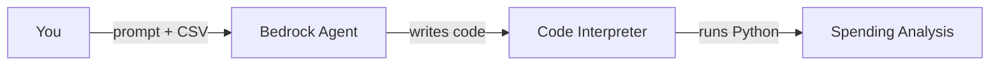
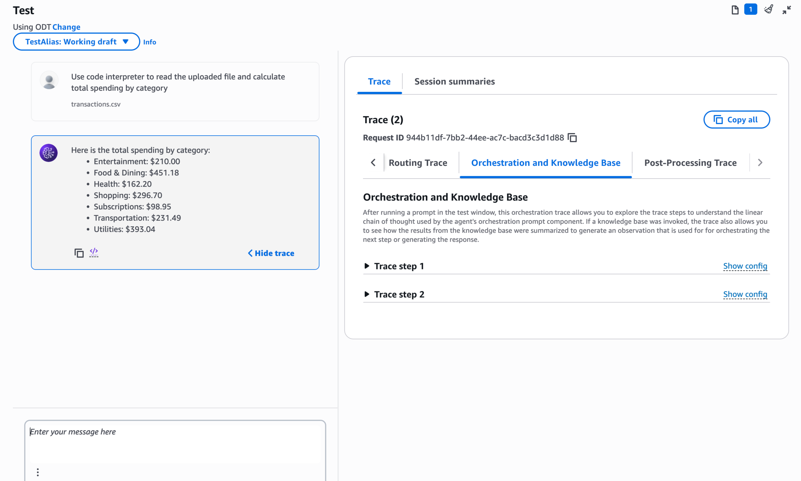
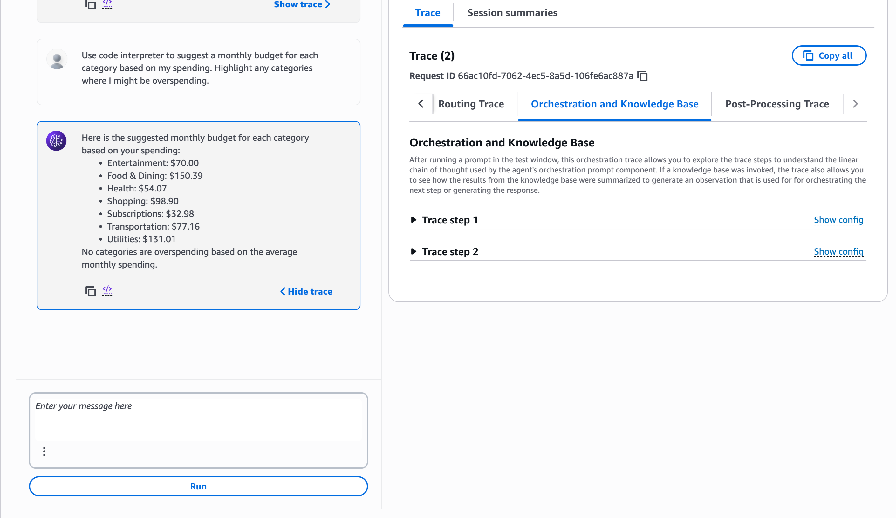

# Personal Finance Advisor — Amazon Bedrock Agent

A personal finance advisor agent built on Amazon Bedrock that uses Code Interpreter to autonomously write and execute Python code. Given a CSV of transactions, the agent categorizes expenses, computes spending breakdowns, and generates budget recommendations on demand, without any predefined analysis logic.

## Objective

Spending analysis typically requires writing and maintaining custom data-processing code. This project delegates that work to the agent itself: rather than hardcoding categorization or aggregation logic, the agent is given a transactions file and a natural language objective, and it writes and executes the Python required to satisfy the request.

## How It Works



The user submits a prompt along with a transactions CSV. The agent interprets the request, writes Python code to process the file, and executes it inside Code Interpreter's sandboxed environment. The resulting output, a categorized spending breakdown or chart, is returned to the user. A memory component allows the agent to retain context from prior turns within and across sessions.

## Agent Configuration

The agent is configured with a single natural language instruction defining its role and scope:

```
You are a personal finance advisor. Analyze spending data, categorize expenses,
and suggest budgets.
```

No additional system logic, action groups, or knowledge bases are required. The agent's analytical capability comes entirely from Code Interpreter, which it invokes autonomously based on the instruction and the user's request.

## Code Interpreter

Code Interpreter is enabled on the agent, giving it the ability to write and execute Python code in a secure, isolated sandbox. This is the mechanism that allows the agent to perform calculations and produce structured output without any custom orchestration: the agent decides what code to write based on the request, runs it, and incorporates the result into its response.

## Validation

The agent was tested with a sample transactions file across two prompts.



The first prompt requested a total spending breakdown by category. The agent used Code Interpreter to parse the CSV and returned category-wise totals across entertainment, food and dining, health, shopping, subscriptions, transportation, and utilities.



The second prompt asked the agent to suggest a monthly budget per category based on the same spending data, and to flag any categories at risk of overspending. The agent computed proportional budget figures for each category and reported that no category exceeded its average monthly spend.

In both cases, the trace panel confirmed the agent's orchestration steps: the request was routed, Code Interpreter was invoked to write and run the corresponding Python, and the result was summarized into the final response.

## Notes

This project was built and tested in the `us-east-1` region using Amazon Bedrock Agents with Code Interpreter enabled. The transactions file used for testing is not included; any CSV with a category and amount column will work with the configuration described above.